# IncluMarket — System Diagrams and Specifications

Single reference for architecture, flows, data, UML, requirements, glossary, and technology.

**FigJam board (all generated diagrams):** [IncluMarket diagrams](https://www.figma.com/board/MUqtGs9UgXpJIGFgH6VS0O)

Live app: [https://inclumarket.vercel.app](https://inclumarket.vercel.app)

| Section | What it covers |
| --- | --- |
| 1. Architecture | Runtime services and integrations |
| 2. Use cases | Guest, buyer, seller, admin |
| 3. Process flowcharts | Purchase, listing, admin |
| 4. ERD | Commerce, messaging, platform |
| 5. UML | Components, class model, sequences, states |
| 6. Functional requirements | What the system must do |
| 7. Non-functional requirements | Quality attributes |
| 8. Terms and definitions | Domain glossary |
| 9. Technology stack | Languages, libraries, hosting |

FigJam cannot generate UML **use-case ovals** or **class diagrams**. Those are modeled here as a use-case flowchart plus a Mermaid `classDiagram` (renders in GitHub / VS Code). Sequence, state, ER, architecture, and process flows are on the FigJam board.

---

## 1. System architecture

Browser → Vercel Edge (Next.js middleware) → IncluMarket App Router → Supabase Postgres. Auth cookies come from Supabase Auth. Checkout/payouts are scaffolded against payment providers (PayMongo primary; Stripe, PayPal, Maya, GCash configurable).

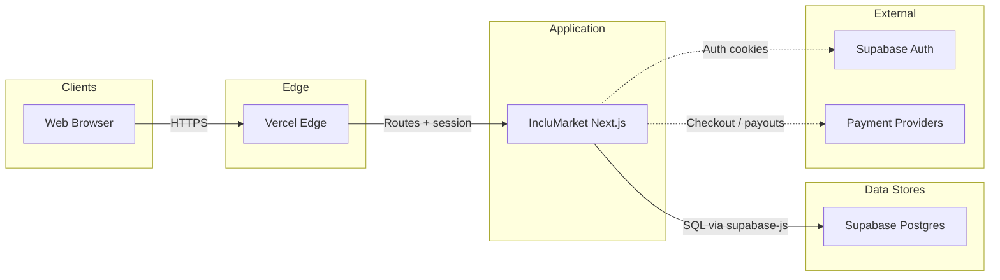

---

## 2. Use cases

Actors: **Guest**, **Buyer**, **Seller**, **Admin**.

```mermaid
flowchart TD
    guest(["Guest"])
    buyer(["Buyer"])
    seller(["Seller"])
    admin(["Admin"])

    subgraph publicUC ["Public"]
        browse["Browse catalog"]
        viewP["View product"]
        chat["Use chatbot"]
        a11y["Accessibility tools"]
        login["Sign in or sign up"]
    end

    subgraph buyerUC ["Buyer"]
        cart["Cart and wishlist"]
        checkout["Checkout order"]
        track["Track orders"]
        review["Review product"]
        msgB["Message seller"]
    end

    subgraph sellerUC ["Seller"]
        listP["List products"]
        fulfill["Fulfill orders"]
        payout["Request payout"]
        msgS["Message buyer"]
    end

    subgraph adminUC ["Admin"]
        users["Manage users"]
        moderate["Moderate products"]
        tickets["Resolve tickets"]
        reports["Export reports"]
    end

    guest --> browse
    guest --> viewP
    guest --> chat
    guest --> a11y
    guest --> login
    login --> buyer
    login --> seller
    login --> admin
    buyer --> browse
    buyer --> cart
    buyer --> checkout
    buyer --> track
    buyer --> review
    buyer --> msgB
    seller --> listP
    seller --> fulfill
    seller --> payout
    seller --> msgS
    admin --> users
    admin --> moderate
    admin --> tickets
    admin --> reports
```

### Use-case inventory

| ID | Actor | Use case | Route / action |
| --- | --- | --- | --- |
| UC-01 | Guest | Browse catalog, search, filter | `/home` |
| UC-02 | Guest | View product detail | `/buyer/product/[id]` |
| UC-03 | Guest | Use floating chatbot | `ChatWidget` |
| UC-04 | Guest | Adjust accessibility prefs | a11y toolbar + `im_ui_prefs` |
| UC-05 | Guest | Sign up / sign in | `/login`, `/auth/callback` |
| UC-06 | Buyer | Cart, wishlist, checkout | `/buyer/cart`, `/buyer/checkout` |
| UC-07 | Buyer | Track orders | `/buyer/orders` |
| UC-08 | Buyer | Review a product | product page |
| UC-09 | Buyer | Message a seller | `/buyer/messages` |
| UC-10 | Buyer | Open a support ticket | `/buyer/support` |
| UC-11 | Seller | Create / edit products and variants | `/seller/products` |
| UC-12 | Seller | Fulfill orders (processing → shipped → delivered) | `/seller/orders` |
| UC-13 | Seller | View reviews | `/seller/reviews` |
| UC-14 | Seller | Request payout | payments / payouts |
| UC-15 | Admin | Manage users and account status | `/admin/users` |
| UC-16 | Admin | Moderate products (approve / flag) | `/admin/products` |
| UC-17 | Admin | Resolve tickets | `/admin/tickets` |
| UC-18 | Admin | Export Excel reports | `/admin/reports` |
| UC-19 | Admin | Configure payment providers | `/admin/payments` |
| UC-20 | Admin | Customize theme tokens | `/admin/theme` |
| UC-21 | Admin | Compliance / audit view | `/admin/compliance` |

---

## 3. Process flowcharts

### 3.1 Buyer purchase

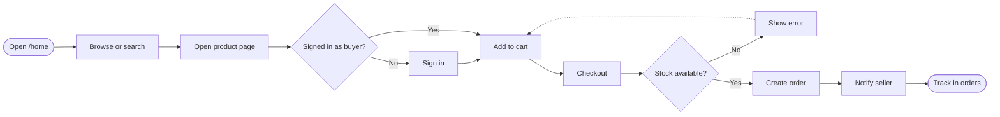

### 3.2 Seller listing and fulfillment

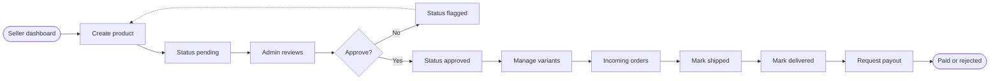

### 3.3 Admin moderation

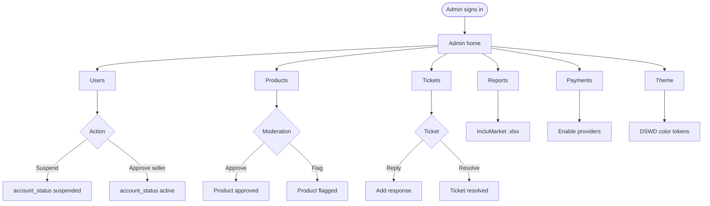

---

## 4. Entity-relationship diagrams

Tables use the `im_` prefix (shared Supabase project with InkluTrack). Profiles link to `auth.users` via `auth_user_id`. Full column lists: `docs/erd.md` and migrations `0001`–`0008`.

### 4.1 Commerce

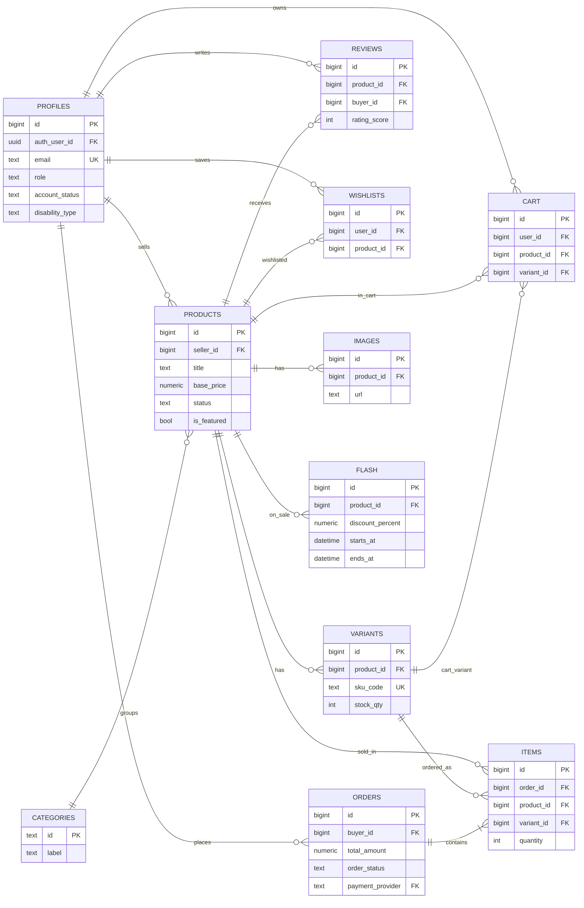

### 4.2 Messaging and support

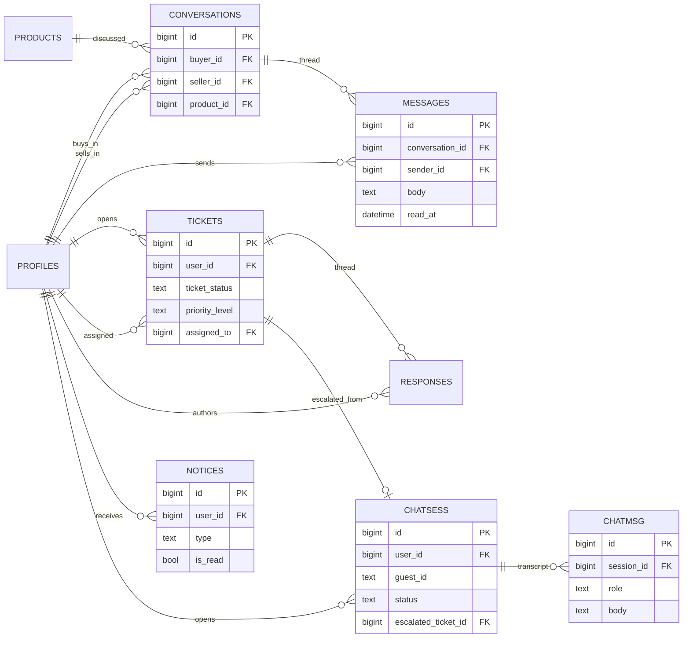

### 4.3 Platform, payments, accessibility

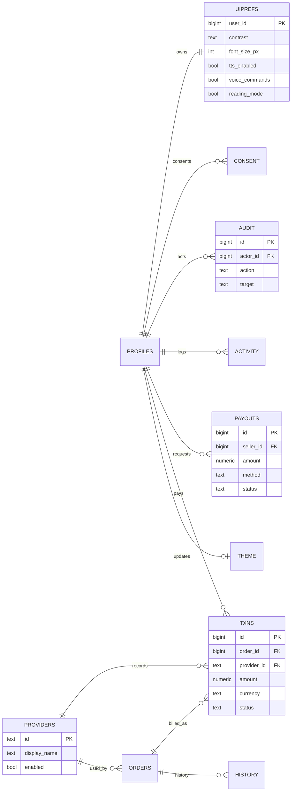

Also: `im_theme_settings` (singleton theme), `im_newsletter_subscribers`, view `im_low_stock_alerts`.

---

## 5. UML

### 5.1 Component layers

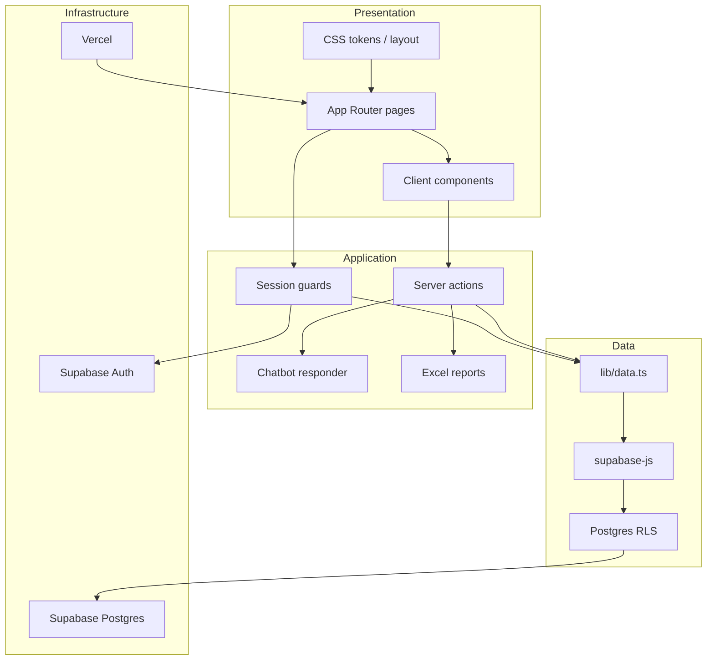

### 5.2 Class diagram (domain)

Not generated in FigJam (unsupported type). Renders in this file.

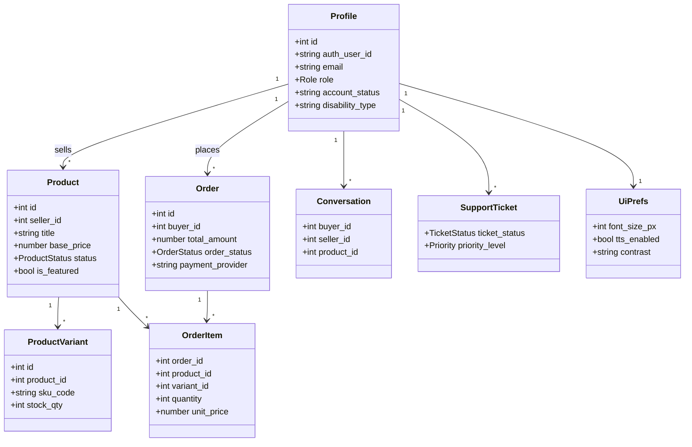

**Enums (from `lib/types.ts` and migrations):**

| Type | Values |
| --- | --- |
| `Role` | `buyer` \| `seller` \| `admin` |
| `ProductStatus` | `pending` \| `approved` \| `flagged` |
| `OrderStatus` | `pending` \| `processing` \| `shipped` \| `delivered` \| `returned` |
| `TicketStatus` | `open` \| `in_progress` \| `resolved` |
| `account_status` | `active` \| `suspended` \| `pending_approval` |
| `payout.status` | `requested` \| `approved` \| `paid` \| `rejected` |
| `transaction.status` | `pending` \| `paid` \| `failed` \| `refunded` |
| Chat session | `open` \| `escalated` \| `closed` |

### 5.3 Sequence — sign in

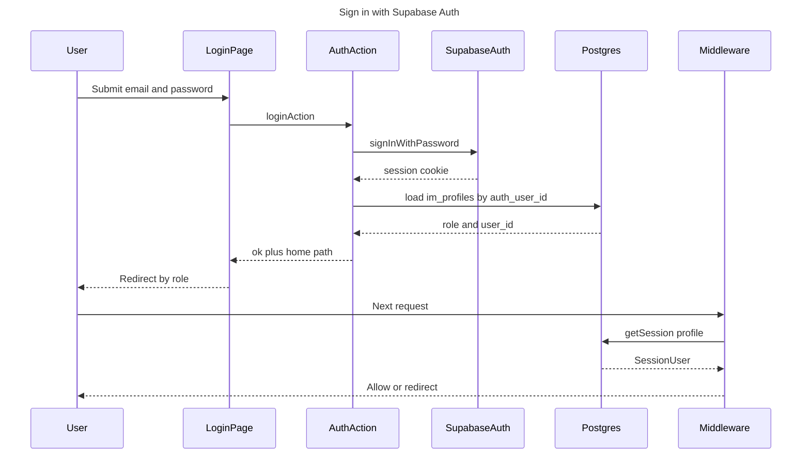

Homes: buyer → `/home`, seller → `/seller/dashboard`, admin → `/admin/users`.

### 5.4 Sequence — checkout

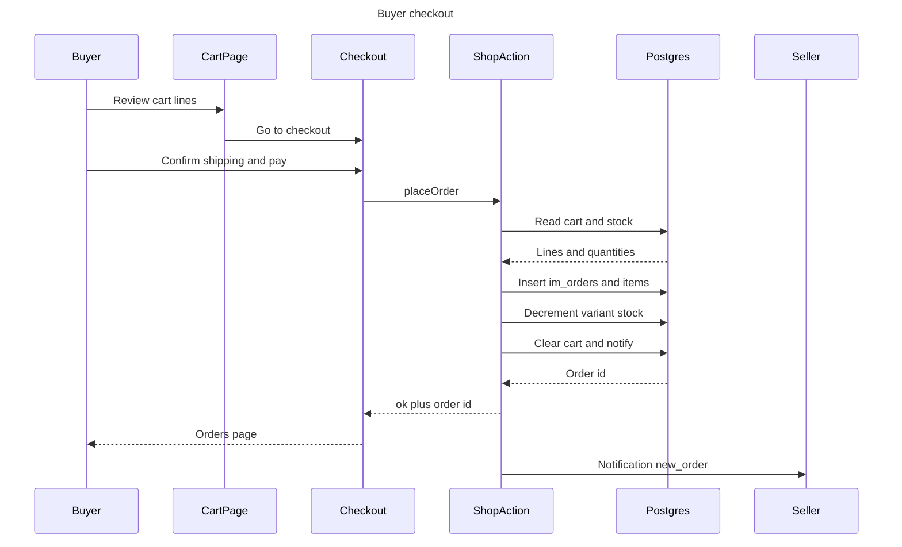

### 5.5 Sequence — messaging

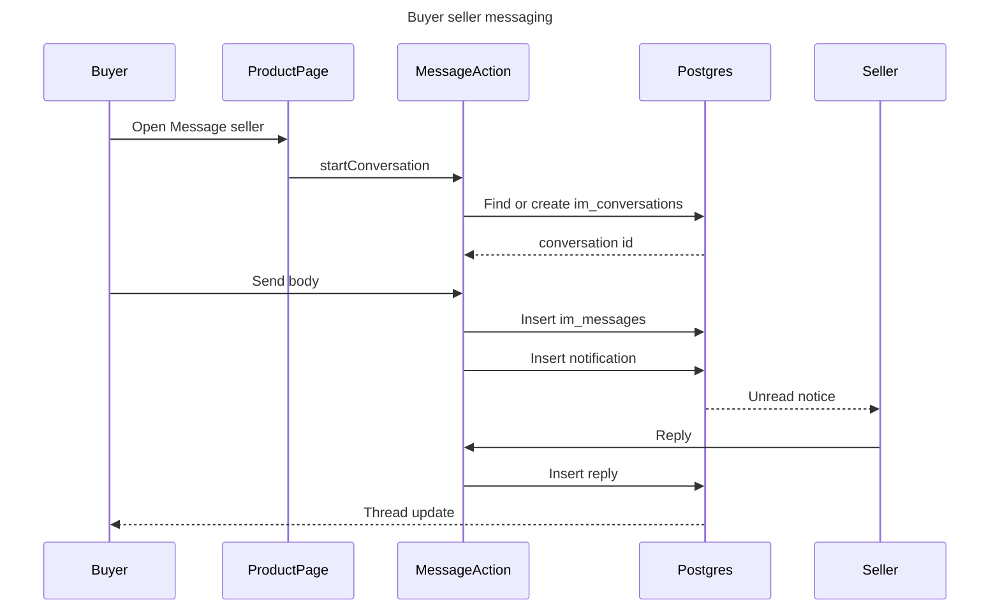

### 5.6 State machines

**Order**

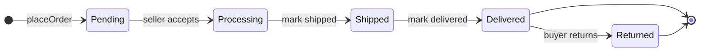

**Product**

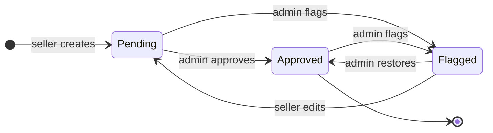

**Support ticket**

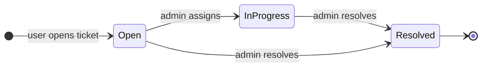

**Account**

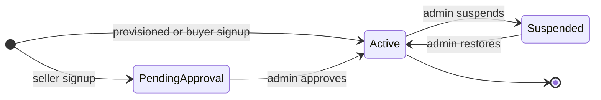

**Seller payout**

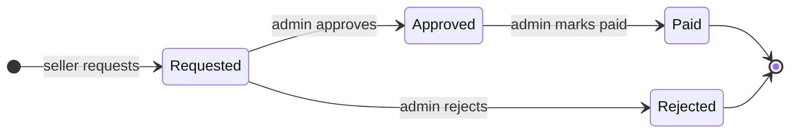

---

## 6. Functional requirements

| ID | Requirement | Source in code |
| --- | --- | --- |
| FR-01 | Users authenticate with email/password via Supabase Auth; unconfirmed signups must confirm email. | `lib/actions/auth.ts` |
| FR-02 | Role-based homes and route guards for buyer, seller, admin. | `lib/session.ts`, middleware |
| FR-03 | Guests and any role may view the public catalog and product pages. | `/home`, `/buyer/product/[id]` |
| FR-04 | Buyers add variants to a server-side cart, wishlist products, and place orders that decrement stock. | `lib/actions/cart.ts`, `shop.ts` |
| FR-05 | Orders record shipping fields and optional payment provider; status history is logged. | `im_orders`, `im_order_status_history` |
| FR-06 | Buyers rate products 1–5 with optional comment. | `im_product_reviews` |
| FR-07 | Buyers and sellers message per conversation (unique buyer+seller pair). | `im_conversations`, `im_messages` |
| FR-08 | Floating chatbot works for guests and users; sessions can escalate to a support ticket. | `ChatWidget`, `im_chat_sessions` |
| FR-09 | Buyers open tickets; admins reply and change status. | `/buyer/support`, `/admin/tickets` |
| FR-10 | Sellers create products (pending until admin approval) with variants, images, and stock. | `/seller/products` |
| FR-11 | Sellers advance order status along the allowed path. | `/seller/orders` |
| FR-12 | Admins approve/flag products, suspend/restore accounts, configure providers, theme, and payments. | `/admin/*` |
| FR-13 | Admins export `.xlsx` reports (users, products, orders, reviews, tickets, audit, or full). | `lib/reports/excel.ts` |
| FR-14 | Accessibility toolbar: font size, contrast, TTS, voice commands, reading mode, reduced motion, visual alerts. | `lib/a11y/prefs.ts`, `im_ui_prefs` |
| FR-15 | In-app notifications for low stock, orders, shipping, reviews, flash sales, messages, chat escalation. | `im_notifications` |
| FR-16 | Flash sales with percent discount and start/end window. | `im_flash_sales` |
| FR-17 | Consent and audit logs for compliance. | `im_consent_logs`, `im_audit_logs` |
| FR-18 | Newsletter subscribe/unsubscribe. | `im_newsletter_subscribers` |
| FR-19 | Static pages: About, Contact, FAQ, Privacy, Terms, Accessibility. | `app/about` etc. |
| FR-20 | Seller payout requests; admin approve/pay/reject. | `im_payouts` |

---

## 7. Non-functional requirements

| ID | Category | Requirement |
| --- | --- | --- |
| NFR-01 | Accessibility | WCAG 2.1 AA: skip link, `main` landmark, keyboard a11y toolbar, high contrast, semantic product cards. |
| NFR-02 | Security | RLS on all `im_*` tables; mutations go through role-checked server actions; service-role key is server-only. |
| NFR-03 | Privacy | Emails masked in cross-role UI and Excel exports; consent logs; no service-role in the browser bundle. |
| NFR-04 | Internationalization | Currency ISO 4217 `PHP`; timestamps ISO 8601 UTC in reports; `en-PH` date formatting in UI. |
| NFR-05 | Performance | Next.js 15 App Router on Vercel; product images client-resized (≤800px, quality 0.82, ≤1 MB data URLs). |
| NFR-06 | Availability | Production on Vercel; Supabase managed Postgres + Auth. |
| NFR-07 | Maintainability | `im_` table prefix; typed domain in `lib/types.ts`; server actions return `{ ok, error }` and write audit rows. |
| NFR-08 | Auditability | Every admin/seller/buyer mutation can write `im_audit_logs`; reports include an audit sheet. |
| NFR-09 | Usability | DSWD blue / red / yellow / white tokens; admin theme customizer; toasts for action feedback. |
| NFR-10 | Integrity | Stock checks at checkout; FK `ON DELETE` cascade or set-null as documented in `docs/erd.md`; payout/transaction amount checks. |
| NFR-11 | Compatibility | Modern evergreen browsers; no native mobile app (responsive web). |
| NFR-12 | Observability | Activity feed (`im_activity_logs`) plus Vercel deployment logs. |

---

## 8. Terms and definitions

| Term | Definition |
| --- | --- |
| **IncluMarket** | PWD-livelihood marketplace in the InkluTrack ecosystem (this Next.js + Supabase app). |
| **PWD** | Person with disability. Profiles store `disability_type`, `assistive_needs`, and optional `pwd_id_url`. |
| **DSWD** | Department of Social Welfare and Development (Philippines). Brand colors: blue (primary), red (compassion), yellow/gold (hope), white (background). |
| **Buyer / Seller / Admin** | The three `im_profiles.role` values. Admin is not available via public signup. |
| **Guest** | Unauthenticated visitor; may browse, use chatbot, and adjust local a11y prefs. |
| **RLS** | Row Level Security — Postgres policies; defense in depth under server-action role checks. |
| **Server action** | Next.js `"use server"` function in `lib/actions/*`; never throws to the UI — returns `{ ok, error }`. |
| **Service role** | Supabase key that bypasses RLS. Used only on the server (`createAdminClient`). |
| **Publishable / anon key** | Public Supabase key; access still limited by RLS. |
| **Variant** | Sellable SKU of a product (`color_name`, `size`, `stock_qty`, `sku_code`). |
| **Flash sale** | Time-bounded percent discount on a product. |
| **Chat session** | Bot transcript (`im_chat_sessions`); may escalate to `im_support_tickets`. |
| **Conversation** | Direct buyer–seller thread, optionally tied to a product. |
| **Payout** | Seller withdrawal request (bank / GCash / Maya / PayPal / other). |
| **Transaction** | Ledger row for an order payment (`im_transactions`). |
| **WCAG 2.1 AA** | Web Content Accessibility Guidelines level AA — target for UI. |
| **TTS** | Text-to-speech in the accessibility toolbar. |
| **ISO 8601 / ISO 4217** | Date-time and currency codes used in Excel reports. |
| **Vercel** | Hosting and CDN for the production Next.js app. |
| **Supabase** | Postgres, Auth, and (optional) dashboard for migrations. |

---

## 9. Technology stack

### Runtime and UI

| Layer | Technology | Version / notes |
| --- | --- | --- |
| Language | TypeScript | ^5.7 |
| UI | React | ^19 |
| Framework | Next.js App Router | ^15 (Turbopack in `dev`) |
| Styling | Hand-authored CSS | `styles/tokens.css`, `layout.css`, `components.css`, `landing.css` |
| Icons | Custom SVG `Icon` + Font Awesome | FA 7.x for selected glyphs |
| Hosting | Vercel | Project `inclumarket` — https://inclumarket.vercel.app |

### Data and auth

| Layer | Technology | Notes |
| --- | --- | --- |
| Database | PostgreSQL (Supabase) | `im_*` schema, migrations `0001`–`0008` |
| Auth | Supabase Auth | Cookie session via `@supabase/ssr` |
| Client | `@supabase/supabase-js` | Server + admin (service role) clients |
| Security | RLS + `im_current_profile_role()` | Policies in `0002`, `0004`, `0006`, `0008` |

### Libraries and standards

| Purpose | Technology |
| --- | --- |
| Excel reports | `exceljs` ^4.4 — OOXML `.xlsx` |
| Money | PHP, ISO 4217 |
| Dates | ISO 8601 UTC in exports; `en-PH` in UI |
| Chatbot | Rule-based `lib/chatbot/responder.ts` (pluggable `CHAT_PROVIDER`) |
| Payments (scaffold) | PayMongo, Stripe, PayPal, Maya, GCash rows in `im_payment_providers` |
| Accessibility | CSS + `im_ui_prefs` + Web Speech API (TTS / voice) |
| Images | Base64 data URLs on `im_product_images` (no Storage bucket) |

### Environment variables

| Name | Scope |
| --- | --- |
| `NEXT_PUBLIC_SUPABASE_URL` | Public |
| `NEXT_PUBLIC_SUPABASE_PUBLISHABLE_KEY` | Public |
| `NEXT_PUBLIC_SITE_URL` | Public (Vercel URL in production) |
| `SUPABASE_SERVICE_ROLE_KEY` | Server only |
| `CHAT_PROVIDER` | Optional |

### Repository layout (diagram-relevant)

```
app/                 Pages (buyer, seller, admin, static, auth)
components/          Client widgets (header, chat, a11y, cards)
lib/actions/         Server mutations
lib/data.ts          Reads
lib/reports/excel.ts Report workbooks
lib/a11y/            Accessibility prefs
lib/chatbot/         Bot responder
supabase/migrations/ Schema + RLS
docs/                This file, erd.md, REBUILD_PLAN.md
```

---

## FigJam diagram index

Open the board, then arrange sections if they overlap: [https://www.figma.com/board/MUqtGs9UgXpJIGFgH6VS0O](https://www.figma.com/board/MUqtGs9UgXpJIGFgH6VS0O)

1. IncluMarket System Architecture  
2. IncluMarket Use Cases  
3. Buyer Purchase Flow  
4. Seller Listing and Fulfillment  
5. Admin Moderation Flow  
6. ERD Commerce Domain  
7. ERD Messaging and Support  
8. ERD Platform Payments A11y  
9. Sequence Sign In  
10. Sequence Checkout  
11. Sequence Messaging  
12. State Order Lifecycle  
13. State Product Moderation  
14. State Support Ticket  
15. State Account Status  
16. State Seller Payout  
17. UML Component Layers  

Suggested board layout: **left** architecture + use cases; **center** process flows + sequences; **right** ERDs; **bottom** state machines. Drag sections in FigJam if generation stacked them.
