# InkluMarket — Entity Relationship Diagram

All InkluMarket tables are namespaced with an `im_` prefix because the Supabase
project is shared with the wider InkluTrack ecosystem (avoids collisions with an
existing `public.profiles` / `public.orders`). Profiles link to Supabase Auth via
`auth_user_id`. Cart lines live in `im_cart_items`.

```mermaid
erDiagram
    im_profiles ||--o{ im_cart_items       : "owns (user_id)"
    im_profiles ||--o{ im_products         : "sells (seller_id)"
    im_profiles ||--o{ im_orders           : "places (buyer_id)"
    im_profiles ||--o{ im_product_reviews  : "writes (buyer_id)"
    im_profiles ||--o{ im_support_tickets  : "opens (user_id)"
    im_profiles ||--o{ im_support_tickets  : "assigned (assigned_to)"
    im_profiles ||--o{ im_ticket_responses : "authors (author_id)"
    im_profiles ||--o{ im_consent_logs     : "consents (user_id)"
    im_profiles ||--o{ im_audit_logs       : "acts (actor_id)"
    im_profiles ||--o| im_theme_settings   : "updates (updated_by)"
    im_profiles ||--o| im_ui_prefs         : "owns (user_id)"

    im_categories ||--o{ im_products        : "groups (category)"

    im_products ||--o{ im_product_variants : "has (product_id)"
    im_products ||--o{ im_product_images   : "has (product_id)"
    im_products ||--o{ im_product_reviews  : "receives (product_id)"
    im_products ||--o{ im_order_items      : "sold in (product_id)"
    im_products ||--o{ im_cart_items       : "in cart (product_id)"

    im_product_variants ||--o{ im_order_items : "ordered as (variant_id)"
    im_product_variants ||--o{ im_cart_items  : "cart variant (variant_id)"

    im_orders ||--o{ im_order_items : "contains (order_id)"

    im_support_tickets ||--o{ im_ticket_responses : "thread (ticket_id)"

    im_profiles {
        bigint  id PK
        uuid    auth_user_id FK "auth.users(id), unique"
        text    name
        text    email UK
        text    role "CHECK buyer|seller|admin"
        text    disability_type
        text    assistive_needs
        timestamptz created_at
        timestamptz updated_at
    }

    im_categories {
        text id PK
        text label
        text folder
    }

    im_products {
        bigint  id PK
        bigint  seller_id FK "im_profiles ON DELETE CASCADE"
        text    title
        text    description
        numeric base_price "CHECK >= 0"
        text    category FK "im_categories ON DELETE SET NULL"
        text    image "emoji fallback"
        text    status "CHECK pending|approved|flagged"
        timestamptz created_at
        timestamptz updated_at
    }

    im_product_variants {
        bigint  id PK
        bigint  product_id FK "im_products ON DELETE CASCADE"
        text    color_name
        text    size
        integer stock_qty "CHECK >= 0"
        text    sku_code UK
    }

    im_product_images {
        bigint  id PK
        bigint  product_id FK "im_products ON DELETE CASCADE"
        text    url
        integer position
    }

    im_orders {
        bigint  id PK
        bigint  buyer_id FK "im_profiles ON DELETE CASCADE"
        numeric total_amount "CHECK >= 0"
        text    order_status "CHECK pending|processing|shipped|delivered|returned"
        timestamptz created_at
    }

    im_order_items {
        bigint  id PK
        bigint  order_id FK "im_orders ON DELETE CASCADE"
        bigint  product_id FK "im_products ON DELETE SET NULL"
        bigint  variant_id FK "im_product_variants ON DELETE SET NULL"
        integer quantity "CHECK > 0"
        numeric unit_price "CHECK >= 0"
    }

    im_product_reviews {
        bigint  id PK
        bigint  product_id FK "im_products ON DELETE CASCADE"
        bigint  buyer_id FK "im_profiles ON DELETE CASCADE"
        integer rating_score "CHECK 1..5"
        text    comment_text
        timestamptz created_at
    }

    im_support_tickets {
        bigint  id PK
        bigint  user_id FK "im_profiles ON DELETE CASCADE"
        text    subject
        text    description_narrative
        text    ticket_status "CHECK open|in_progress|resolved"
        text    priority_level "CHECK low|medium|high"
        bigint  assigned_to FK "im_profiles ON DELETE SET NULL"
        timestamptz created_at
        timestamptz updated_at
    }

    im_ticket_responses {
        bigint  id PK
        bigint  ticket_id FK "im_support_tickets ON DELETE CASCADE"
        text    author_role "CHECK buyer|seller|admin"
        bigint  author_id FK "im_profiles ON DELETE SET NULL"
        text    message
        timestamptz created_at
    }

    im_consent_logs {
        bigint  id PK
        bigint  user_id FK "im_profiles ON DELETE CASCADE"
        text    action
        boolean consent
        text    purpose
        timestamptz created_at
    }

    im_audit_logs {
        bigint  id PK
        bigint  actor_id FK "im_profiles ON DELETE SET NULL"
        text    actor_role
        text    action
        text    target
        timestamptz created_at
    }

    im_theme_settings {
        integer id PK "singleton, CHECK id = 1"
        text    theme_preset
        text    color_nav
        text    color_body
        text    color_footer
        text    color_nav_text
        text    color_footer_text
        bigint  updated_by FK "im_profiles ON DELETE SET NULL"
        timestamptz updated_at
    }

    im_ui_prefs {
        bigint  user_id PK "FK im_profiles ON DELETE CASCADE"
        text    contrast "CHECK default|high"
        text    theme_preset
        timestamptz updated_at
    }
```

## Referential integrity summary

| Child                | Parent(s)                              | On delete            |
| -------------------- | -------------------------------------- | -------------------- |
| im_products          | im_profiles (seller), im_categories    | CASCADE / SET NULL   |
| im_product_variants  | im_products                            | CASCADE              |
| im_product_images    | im_products                            | CASCADE              |
| im_orders            | im_profiles (buyer)                    | CASCADE              |
| im_order_items       | im_orders, im_products, im_variants    | CASCADE / SET NULL   |
| im_product_reviews   | im_products, im_profiles (buyer)       | CASCADE              |
| im_support_tickets   | im_profiles (user, assigned_to)        | CASCADE / SET NULL   |
| im_ticket_responses  | im_support_tickets, im_profiles        | CASCADE / SET NULL   |
| im_consent_logs      | im_profiles                            | CASCADE              |
| im_audit_logs        | im_profiles (actor)                    | SET NULL (preserve)  |
| im_theme_settings    | im_profiles (updated_by)               | SET NULL             |
| im_ui_prefs          | im_profiles                            | CASCADE              |

Audit rows survive user deletion (`actor_id` set to NULL) so the compliance trail
stays intact — the one intentional exception to the cascade rules.
